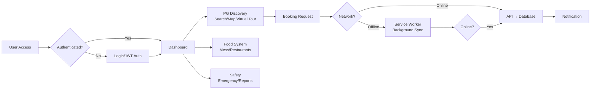
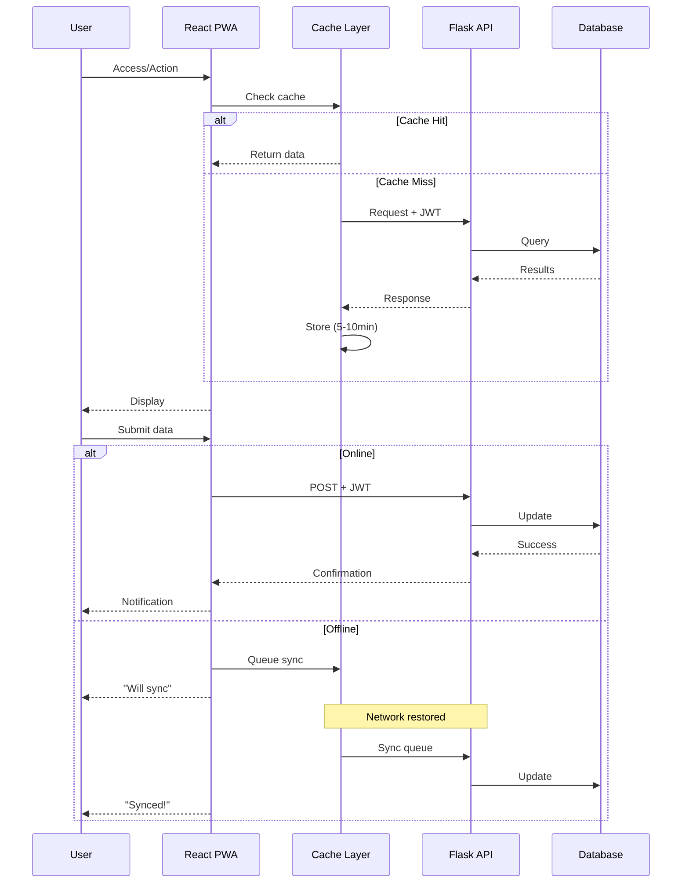
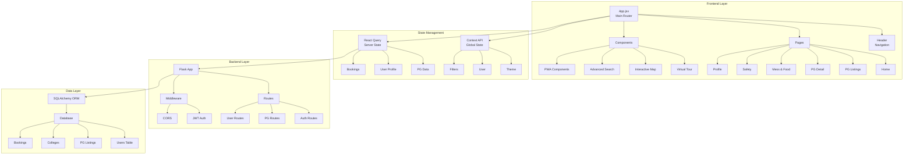

# CampusNest — System Diagrams

## 1. System Flowchart (Generalized Architecture)

## 2. Sequence Diagram (Generalized System Interaction)

## 3. Component Architecture Diagram

---

## Diagram Usage Instructions

These diagrams are written in **Mermaid** syntax and can be rendered in:
- **GitHub** (native support in markdown)
- **VS Code** with Mermaid Preview extension
- Online tools: https://mermaid.live/
- Documentation platforms: GitBook, Docusaurus, MkDocs

To view these diagrams:
1. Push this file to GitHub and view it there
2. Install "Markdown Preview Mermaid Support" VS Code extension
3. Copy-paste into mermaid.live for interactive editing
